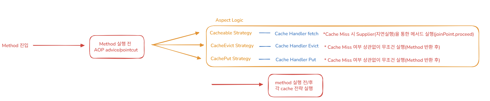
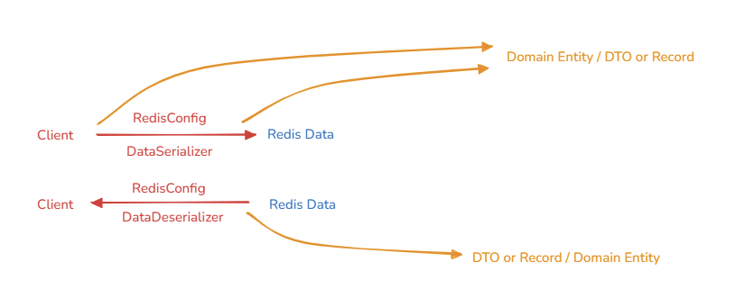
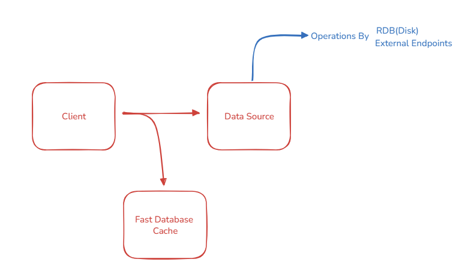
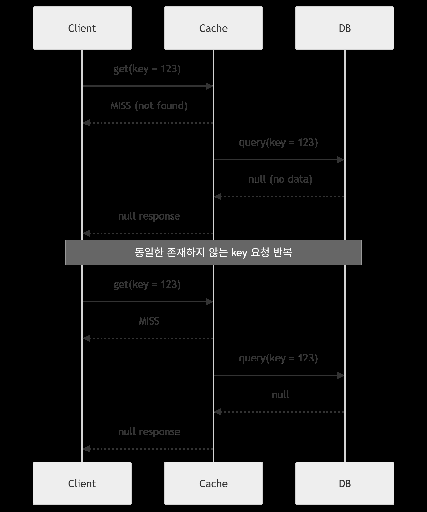
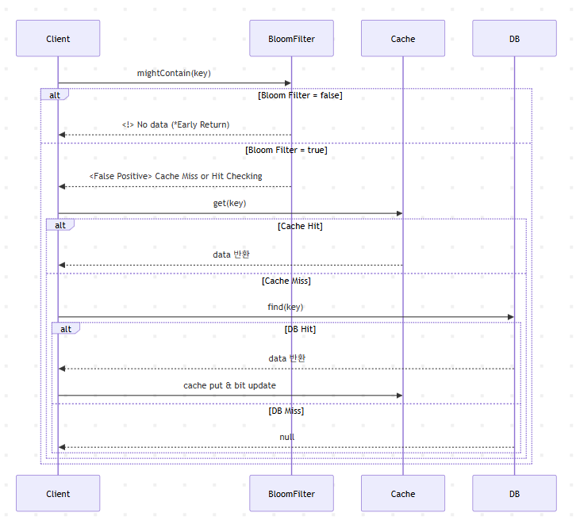
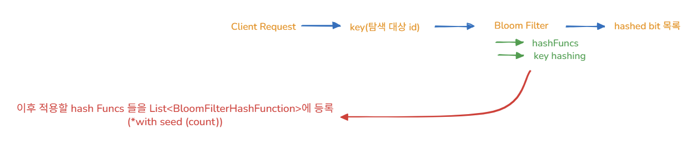
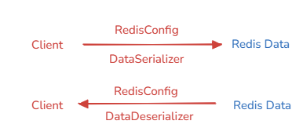
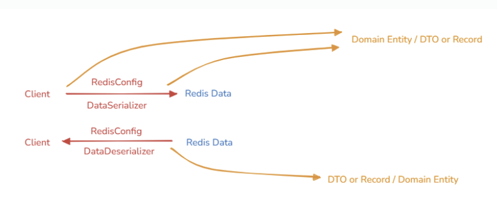

## 1.  개요

- Java ver 21.
- Spring Boot ver 3.5.6
- Redis ver 8.2.1
- MySQL ver 8.0.42

## 2. Projects

- redis 사상 및 목적에 맞는, 그러면서도 병목 현상을 줄이기 위한 다양한 pattern 적용 방안
- spring boot project

## 3. Architecturing

- Cache Strategies (*Customized)

- domain models

## 4. Redis cache for what?

> Redis Cache
> - DataSource의 데이터 접근 및 부하의 속도와 병목을 보완하기 위한 캐싱 전략 도구

Redis를 도입한 순간 부터, 기본적인 부하의 진입점은 Cache이다.
- 모든 데이터를 캐싱할 필요는 없지만, 기본적인 부하 분산 및 조회 성능 향상을 확보해야 함.
- 비싼 비용을 감수하면서 도입하는 체계이다.

## 5. Redis Patterns to avoid bottlenecks

## 5-1. Cache Penetration

- DB에 존재하지 않은 데이터 요청이 지속적으로 발생하여, cache miss 및 DB call이 지속적으로 발생하는 현상

## 5-1-1. Null Object Pattern

- 원본 datasource에 존재하지 않는 null data에 대해 객체로 표현(Null Object)하는 방법.
- 단순 Null보다 유연한 관리 가능, Null Value 처리에 대한 위험 감소 및 Clean Code 가능(분기처리 제거).

> Null Object에 대한 규칙 정립
- 동일한 Null 객체더라도 그에 대한 구체적인 사유와 함께, Null Caching을 구체화.

## 5-1-2. Bloom Filter

- 메모리 비효율적인 Null Object 방식에 비해 Hasing/Bitmap 기반의 빠른 Caching 판단을 가능하게 하는 자료구조.
- Key hashing을 통해 Caching 여부를 확률적으로 판단하여, datasource의 부하를 분산한다.
  - 없으면 확실히 없으므로 Early Return
  - 있으면 확실히 있는지 필요 시 판단(False Positive, Redis Caching)하고 최종적으로 없을때 datasource 접근

- hash Funcs 먼저 등록, 이후 사용(BloomFilter 구현체 구현 및 이후 hash 적용).

## Appendix. Redis Architecturing

- RedisConfig / DataSerializer / DataDeserializer

- Entity / Record(DTO)

