**자세한 내용은 벨로그를 통해 자세히 기술 :**
- [부하 분산 :  Redis 시리즈 #1](https://velog.io/@gyrbs22/%EB%B0%B1%EC%97%94%EB%93%9C-Redis%EC%97%90-%EB%8C%80%ED%95%9C-%EA%B3%A0%EC%B0%B0Redis%EC%97%90%EC%84%9C-%EB%B0%9C%EC%83%9D%EA%B0%80%EB%8A%A5%ED%95%9C-%EB%8B%A4%EC%96%91%ED%95%9C-%EC%8B%A4%EB%AC%B4%EC%A0%81-%EC%83%81%ED%99%A9%EA%B3%BC-%EC%9D%B4%EC%97%90-%EB%8C%80%ED%95%9C-Trouble-Shootings-3-TDD%EA%B8%B0%EB%B0%98%EC%9D%98-Redis-Patterns-trouble-Shootings-1)
- [부하 분산 : Reids 시리즈 #2](https://velog.io/@gyrbs22/%EB%B0%B1%EC%97%94%EB%93%9C-Redis%EC%97%90-%EB%8C%80%ED%95%9C-%EA%B3%A0%EC%B0%B0Redis%EC%97%90%EC%84%9C-%EB%B0%9C%EC%83%9D%EA%B0%80%EB%8A%A5%ED%95%9C-%EB%8B%A4%EC%96%91%ED%95%9C-%EC%8B%A4%EB%AC%B4%EC%A0%81-%EC%83%81%ED%99%A9%EA%B3%BC-%EC%9D%B4%EC%97%90-%EB%8C%80%ED%95%9C-Trouble-Shootings-4-TDD%EA%B8%B0%EB%B0%98%EC%9D%98-Redis-Patterns-trouble-Shootings-2)
- [부하 조절 : Circuit Breaker/Semaphore Bulkhead](https://velog.io/@gyrbs22/%EB%B0%B1%EC%97%94%EB%93%9C-%EB%B6%84%EC%82%B0-%ED%8A%B8%EB%9E%9C%EC%9E%AD%EC%85%98-Trouble-ShootingCircuit-Breaker-%EB%B0%8F-MSA-%EC%84%9C%EB%B2%84-%EB%B3%84-%EB%B6%84%EC%82%B0%EC%B6%94%EC%A0%81%EB%AA%A8%EB%8B%88%ED%84%B0%EB%A7%81-%ED%99%98%EA%B2%BD-%EA%B5%AC%EC%84%B1-%EB%B0%A9%EC%95%88)
- [부하 조절 : 인프라 구축없이 Servlet Filter/JVM Blocking Queue/Semaphore 만으로 Saturation 2배 개선](https://velog.io/@gyrbs22/%EB%B0%B1%EC%97%94%EB%93%9C-%EC%8B%9C%EC%8A%A4%ED%85%9C%EA%B3%BC-%EA%B0%80%EC%9E%A5-%EC%89%BD%EA%B3%A0-%EA%B0%95%EB%A0%A5%ED%95%98%EA%B2%8C-%EC%83%81%ED%98%B8%EC%9E%91%EC%9A%A9-%ED%95%A0-%EC%88%98-%EC%9E%88%EB%8A%94-%EB%B0%A9%EB%B2%95-4-Series3-%EB%B6%80%ED%95%98%EC%A1%B0%EC%A0%88%EA%B3%BC-%EC%8B%9C%EC%8A%A4%ED%85%9C-Admission-ControllerInner-Semaphore)
- [GC튜닝 및 GC Pause Time 개선/WAS latency와의 상관관계 시리즈 #1](https://velog.io/@gyrbs22/%EB%B0%B1%EC%97%94%EB%93%9C-%EC%8B%9C%EC%8A%A4%ED%85%9C%EA%B3%BC-%EA%B0%80%EC%9E%A5-%EC%89%BD%EA%B3%A0-%EA%B0%95%EB%A0%A5%ED%95%98%EA%B2%8C-%EC%83%81%ED%98%B8%EC%9E%91%EC%9A%A9-%ED%95%A0-%EC%88%98-%EC%9E%88%EB%8A%94-%EB%B0%A9%EB%B2%95-2-%EB%AA%A8%EB%8B%88%ED%84%B0%EB%A7%81-%EA%B7%B8%EB%A6%AC%EA%B3%A0-%EB%B3%91%EB%AA%A9%ED%95%B4%EC%86%8C%EC%9D%98-%EA%B4%80%EC%A0%901000-RPS-%ED%99%98%EA%B2%BD%EC%9D%84-%EA%B5%AC%ED%98%84%ED%95%98%EC%97%AC-DBWAS-level%EC%97%90%EC%84%9C-%EA%B0%81-%EC%A7%80%EC%A0%90%EB%B3%84-%EC%A0%81%EC%9A%A9%ED%95%9C-%EA%B0%9C%EC%84%A0-%EB%B0%A9%EC%95%88%EA%B0%9C%EC%84%A0%EB%A5%A0-%EB%B9%84%EA%B5%90-Series1%ED%8C%8C%EC%9D%B4%ED%94%84%EB%9D%BC%EC%9D%B8-%EA%B5%AC%EC%B6%95)
- [GC튜닝 및 GC Pause Time 개선/WAS latency와의 상관관계 시리즈 #2](https://velog.io/@gyrbs22/%EB%B0%B1%EC%97%94%EB%93%9C-%EC%8B%9C%EC%8A%A4%ED%85%9C%EA%B3%BC-%EA%B0%80%EC%9E%A5-%EC%89%BD%EA%B3%A0-%EA%B0%95%EB%A0%A5%ED%95%98%EA%B2%8C-%EC%83%81%ED%98%B8%EC%9E%91%EC%9A%A9-%ED%95%A0-%EC%88%98-%EC%9E%88%EB%8A%94-%EB%B0%A9%EB%B2%95-3-%EC%84%B1%EB%8A%A5-%EA%B0%9C%EC%84%A0-%EB%AA%A8%EB%8B%88%ED%84%B0%EB%A7%81Saturation%EC%9D%B4-%EB%B0%9C%EC%83%9D%ED%95%98%EC%98%80%EC%9D%84%EB%95%8C-DBWAS-%EA%B3%84%EC%B8%B5%EB%B3%84-%EC%A0%81%EC%9A%A9%ED%95%9C-%EA%B0%9C%EC%84%A0-%EB%B0%A9%EC%95%88%EA%B0%9C%EC%84%A0%EB%A5%A0-%EB%B9%84%EA%B5%90-Series2%EA%B0%9C%EC%84%A0%EC%A0%90-%EC%A0%81%EC%9A%A9%EA%B3%BC-%EA%B0%9C%EC%84%A0%EB%A5%A0-%EB%B9%84%EA%B5%90)

## 1. Project 개요

본 Trouble Shootings은 "부하"가 과도하게 집중되는 상황에서 분산 / 조절의 관점에서 성능을 개선할 수 있는 요건을 살펴본다.

> DB에 가해지는 부하가 과도하여 WAS 병목 및 시스템 처리 지연까지 유발할때, 어떻게 대처해야 하는가?

> WAS에 가해지는 부하가 시스템 성능에 맞지 않게 과도하여 트래픽 규모를 조절할 필요가 있다면?

세부적으로,
- redis 사상 및 목적에 맞으면서 DB의 병목을 감소할 수 있는 Redis Patterns 적용 방안
- TDD
  - Test Configuration / Util과 의존성 테스트, 단위 테스트, 통합 테스트 등 
  - 목적에 맞게 테스트 책임 분리하여 진행.

에 대해 부수적으로 같이 살펴보도록 한다.

## 3. Architecturing

- Cache Strategies (*Customized)

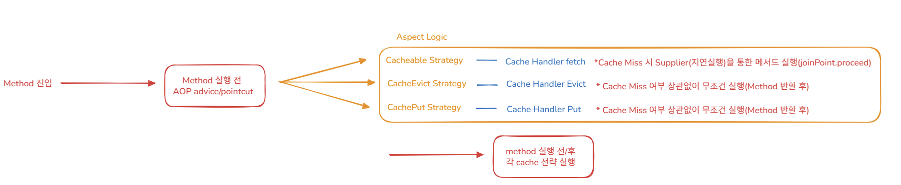

- domain models

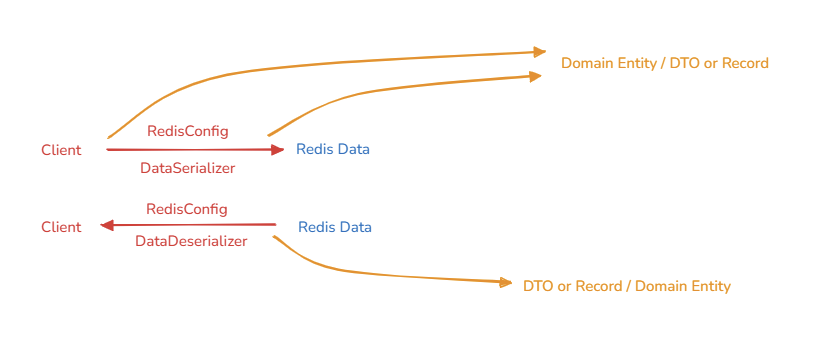

## 4. Redis cache for what?

> Redis Cache
> - DataSource의 데이터 접근 및 부하의 속도와 병목을 보완하기 위한 캐싱 전략 도구

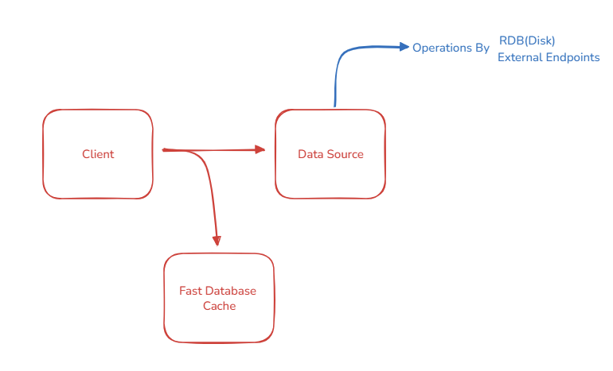

Redis를 도입한 순간 부터, 기본적인 부하의 진입점은 Cache이다.
- 모든 데이터를 캐싱할 필요는 없지만, 기본적인 부하 분산 및 조회 성능 향상을 확보해야 함.
- 비싼 비용을 감수하면서 도입하는 체계이다.

## 5. Redis Patterns to avoid bottlenecks

## 5-1. Cache Penetration

- DB에 존재하지 않은 데이터 요청이 지속적으로 발생하여, cache miss 및 DB call이 지속적으로 발생하는 현상

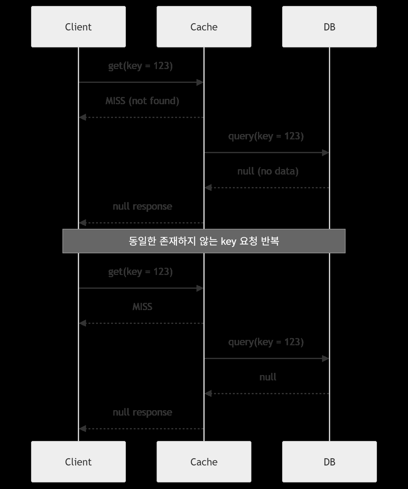

## 5-1-1. Null Object Pattern

- 원본 datasource에 존재하지 않는 null data에 대해 객체로 표현(Null Object)하는 방법.
- 단순 Null보다 유연한 관리 가능, Null Value 처리에 대한 위험 감소 및 Clean Code 가능(분기처리 제거).

> Null Object에 대한 규칙 정립
- 동일한 Null 객체더라도 그에 대한 구체적인 사유와 함께, Null Caching을 구체화.

## 5-1-2. Bloom Filter

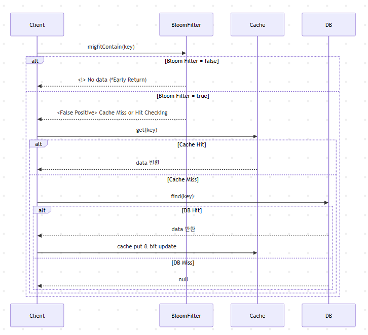

- 메모리 비효율적인 Null Object 방식에 비해 Hasing/Bitmap 기반의 빠른 Caching 판단을 가능하게 하는 자료구조.
- Key hashing을 통해 Caching 여부를 확률적으로 판단하여, datasource의 부하를 분산한다.
  - 없으면 확실히 없으므로 Early Return
  - 있으면 확실히 있는지 필요 시 판단(False Positive, Redis Caching)하고 최종적으로 없을때 datasource 접근

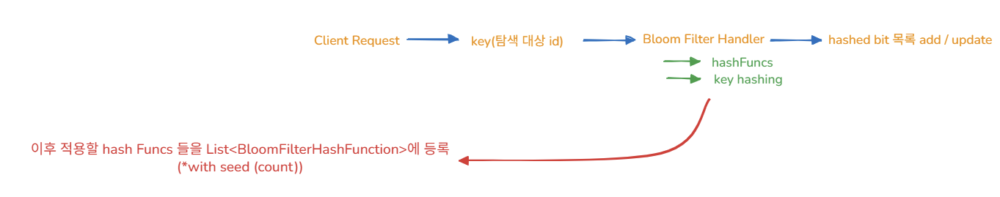

- hash Funcs 먼저 등록, 이후 사용(BloomFilter 구현체 구현 및 이후 hash 적용).
- key - value entry 중, 특정 key에 대한 value에 대해 hashed indices를 bitmap에 압축하여 저장하는 형태이다.
  - userId : 2일때,
    - key = bloom-filters:users
    - value = bitmap 형태로 압축해서 저장, Redis String이 bit array처럼 쓰이는 것.
- No data, No Service Call, 있을 경우에만 Service 호출.

``
bloom filters :
``
 
``
key        value
bf:users → "0100100010010..." (bit array)
``

- 기본적으로 set bit 연산은 bloom filter 규모가 커질 수록 연산 효율 및 오차율 측면에서 불리할 수 있다.
  - init을 하여 사용할 bitmap 영역을 선제적 할당.

> Problem
- 데이터 탐색 규모가 커지면 그만큼 No data 탐색, 이에 따른 Cache Penetration 발생.
- 입력 데이터가 많아진다면, False Positive 발생 횟수는 비례하여 증가.
- 고정된 크기의 Bloom Filter, 데이터 삭제가 불가능.

## 참고1. Bloom Filter Split

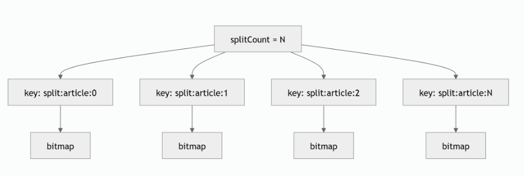

> Bloom filter를 split하여 메모리 초기화의 부담을 분할하여 덜어주는 것이 핵심.
- bitmap의 최대 크기는 512MB(32bit), 이를 넘어선 크기가 필요하다면 그만큼의 분할된(Split) Bloom Filter를 사용하는 방안.
- Redis Cluster의 Slot처럼, 각 Bloom Filter는 자신에게 할당된 Split 번호 및 비트 인덱스를 관리한다.

## 참고2. Bloom Filter Shard

> 단일 Bloom Filter가 아닌, 작은 bitmap으로 구성된 여러 bloom filter를 운용하는 것.
- 중요한 점은 각 bloom filter는 물리적으로 분리되었다는 점
- 각 물리적으로 샤드된 bloom filter를 split bloom filter로 논리적 분리가 가능해진다.
  - 부하 분산 및 데이터 분산 등 고가용성, 메모리 효율 측면에서 더욱 향상됨.

## 참고3. Bloom Filter Sub filter

> Progress

> sub filter adding

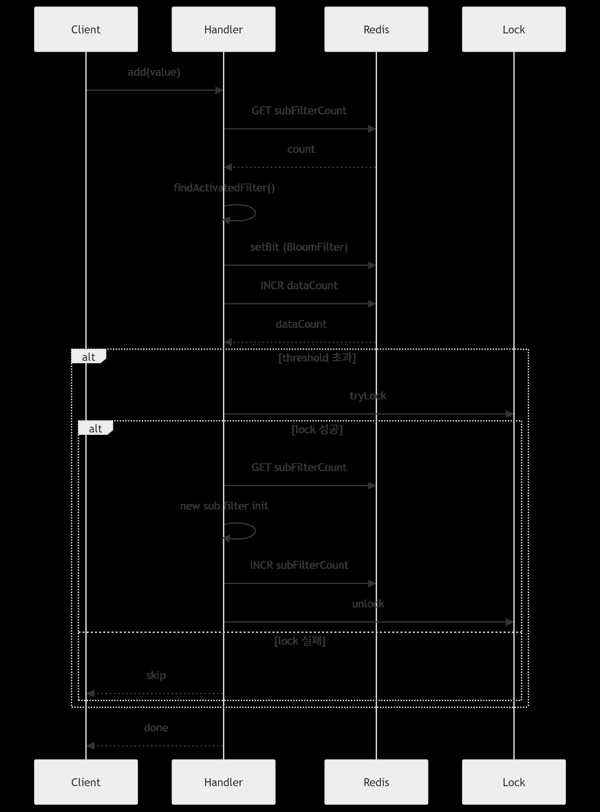

> Bloom filter의 교체는 어렵기에, 새롭게 생성해서 신규 filtering으로 운용
- 기존 bloom filter에, 점진적 오차 감소율 및 데이터 규모를 적용하여 sub filter를 생성한다.
- application level에서 sub filter 개수에 대한 over counting / sub filter over init을 방지하기 위해 분산 락을 활용
  - INCR 연산에 대해서는 Redis level에서 이루어지므로 원자성 확보 가능 및 성능 O(1) 보장.

# Split Sharded Bloom Filter 원본 + 하위 Split Sharded Sub Bloom Filter * 3개 시스템 구조

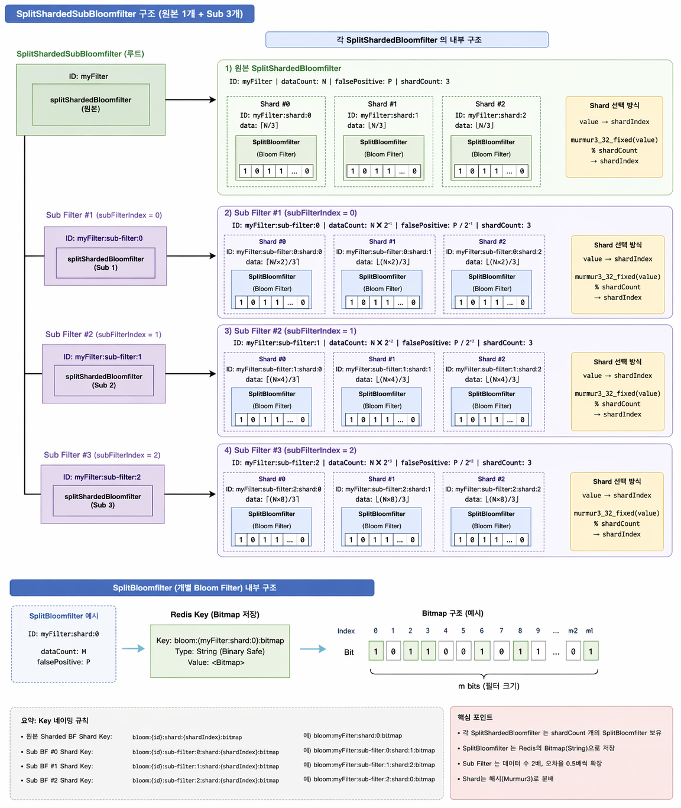

## 5-2. Cache Stampede

> 데이터는 있지만, Cache Miss로 인해 datasource로 트래픽이 "쏠리는" 현상.
- penetration이 없는 데이터에 대한 요청이라면,
- stampede는 데이터가 있음에도, Cache에는 없어(Cache Miss) data source에 데이터 병목이 발생하는 현상

## 5-2-1. Jitter

> 네트워크 상에서 데이터 패킷 도착 시간의 미세한 오차(떨림) 현상
- Caching 만료 시간(TTL)에 미세한 편차를 두어, 일괄적인 캐싱 만료에 의한 Cache Stampede 현상을 방지하는 전략.

- ASIS : 동시에 캐시 만료, data source 트래픽 쏠림

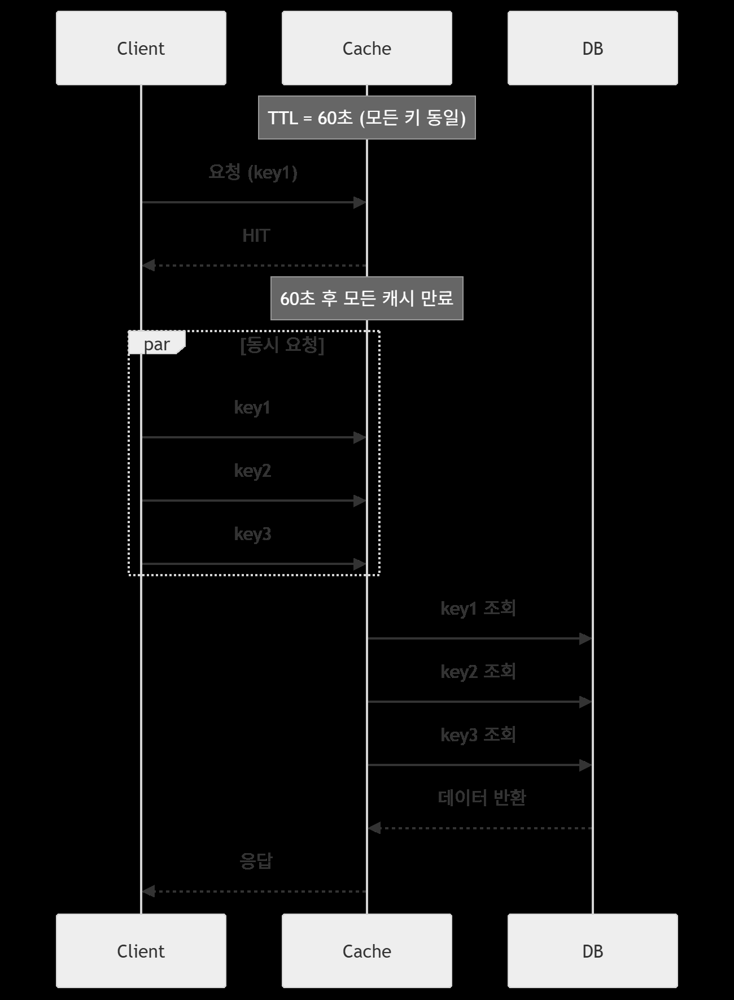

- TOBE : 캐시 만료 시간에 편차, data source 트래픽 분산

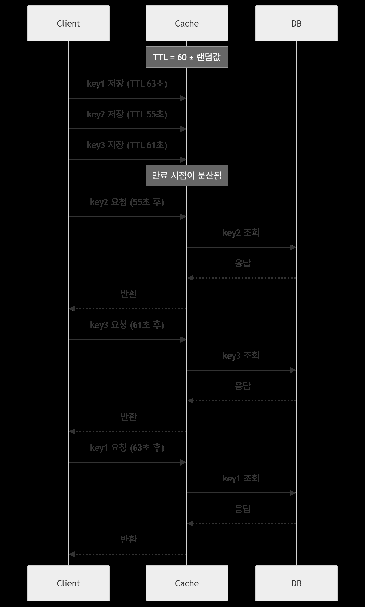

## 5-2-2. Probablistic Early Recomputation

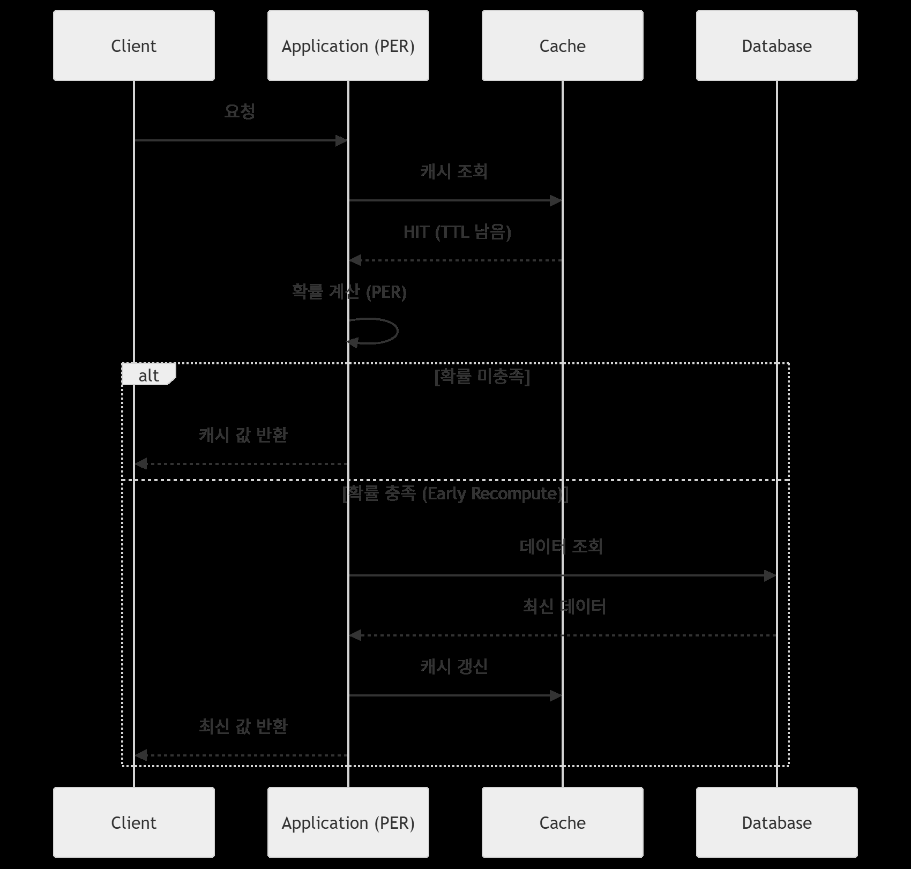

> 확률적 조기 갱신
- 특정 확률식을 적용하여 캐싱 만료 확률이 특정 기준이상으로 커질때 조기에 캐싱 갱신하는 전략.
- 갱신 만료 확률이 큰 특정 요청에 대해 캐싱 갱신 책임을 위임, 조기에 캐싱을 갱신한다.

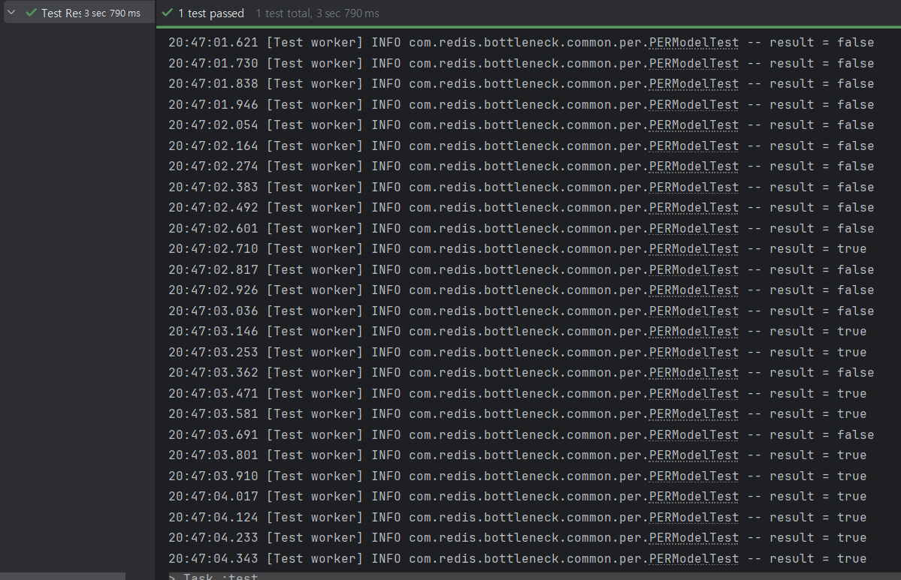

- 시간이 지남에 따라 캐싱 갱신 확률은 점진적으로 증가.

## 5-2-3. Request Collapsing

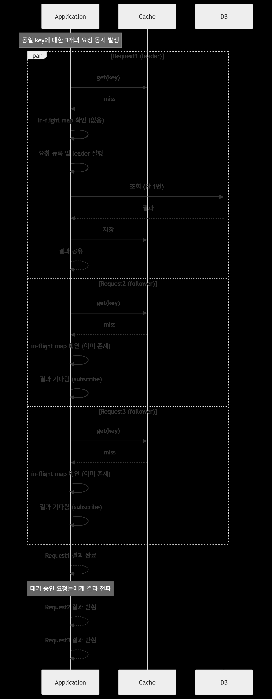

> 요청 단일화
- 중복된, 동일한 캐시 데이터 갱신에 대한 서비스 요청이 다수 왔을때 1개의 요청에 대해서만 진행하도록, data source 요청을 "단일화"하는 전략.
- 분산락을 사용하는 등, 중복된 다수의 요청이 왔을때, 최초 요청에 대해서만 캐싱 갱신을 진행하는 것이 핵심.
  - 캐시 갱신 시 선행 요청의 갱신 실패 경우를 고려하여, 주기적 polling을 통해 갱신 여부 확인
  - 갱신 안되어있을 경우, 후행 요청이 갱신.
- 굳이 기다리지 않고, 이전의 캐싱 데이터를 활용할 수도 있다.

※ 분산락과 데이터 key 혼용 유의

## 5-2-4. Rate Limit

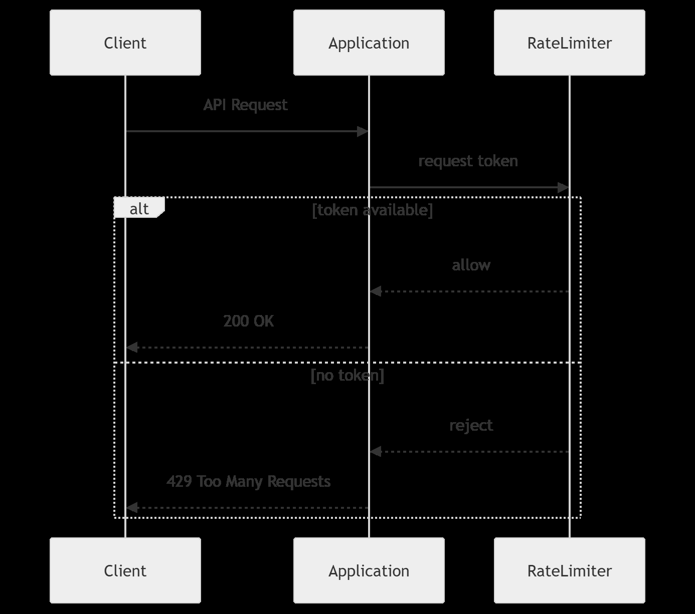

> data source 트래픽의 최대 허용 개수를 정책화
- Jitter / PER / RC는 어찌되었든 최초 요청은 data source를 호출, 다양한 캐싱 데이터가 존재하는 대규모 트래픽 환경에서는 병목 유발 가능.
- 애초에 data source에 접근 가능한 트래픽의 절대적 규모를 제한하여 시스템의 전면적인 장애 발생을 방지.

> Multi Layer Rate Limiting
- 병목은 datasource에서 발생하며, Application의 트래픽은 Caching에 의해 확장 가능성이 존재한다.
- 단일 진입점 적용이 아닌, Caching의 효율적인 활용도 고려하면서 Token 분리(Dual Rate Limit) 및 적절한 분기처리 적용이 필요.
  - cache miss 상황까지 고려하여, Application / datasource 등 각 지점에 대한 유연한 적용이 필요.

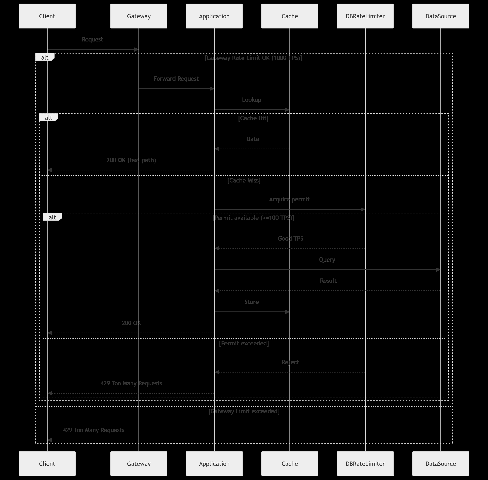

- Multi layer and aware caching (cache miss 시 datasource 요청 (*RL datasource 진입점 적용))
  - 다수 진입점에 대한 Rate Limit 분리 운용, cache miss 시 캐시 데이터 갱신.  

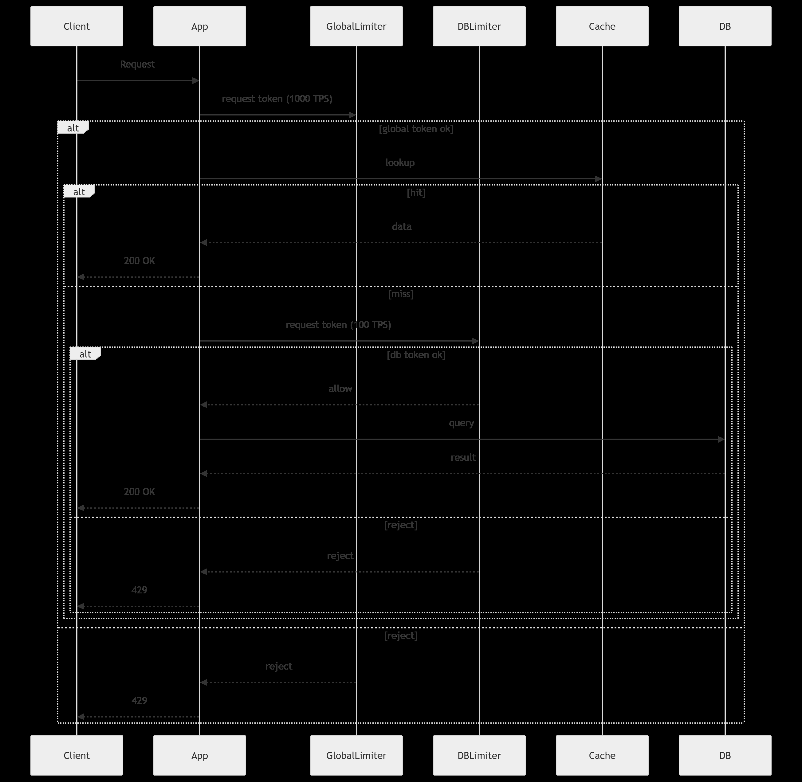

- Multi layer and multi token
  - 단순 허용 개수 이상의 트래픽 발생 시 그대로 요청 거부

## 5-2-5. Write Through

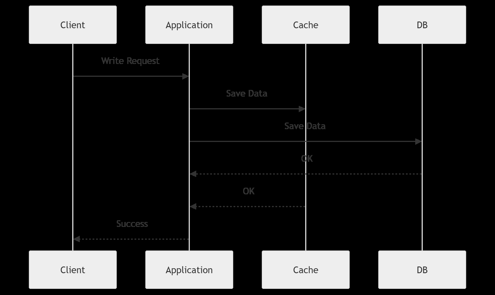

> 데이터가 필요한 시점에 모든 데이터를 캐싱하는 것이 아니라, 생성/삭제/수정 시점에 단건 데이터를 실시간으로 캐싱하는 전략.
- 실시간으로 단건 데이터를 반영하여, **필요한 소수의 데이터에 대해서만 캐싱을 유지하는 것이 핵심.**
- 노출 빈도가 높은 hot data에 대하여 data source의 병목을 방지하고, 미리 캐싱하여 cache hit를 극대화한다.
  - 단건 데이터, hot data 조회의 근원인 sorted set의 정합성을 고려하는 것도 필요.

## Appendix. Seperated(Sharded) Application for Hot Key

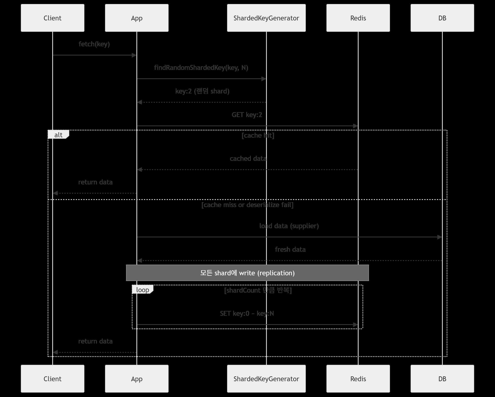

- data source에 병목을 주는 원인은 대규모 트래픽, 그리고 조회율이 높은 Hot Data.
- Redis Caching 처리를 하더라도, Hot data는 곧 Redis 부하 부담을 의미한다.
  - 데이터 규모가 크더라도, 활용도가 높은 데이터는 소수의 10%.

> Hot Key, Hot Data 연산에 집중하는 별도의 서버, Application을 두어 부하를 분담하자.
- 즉, 핵심은 Application level에서 추가적인 샤딩 등을 통해 부하 분산을 이끌어내는 것.
  - 일반적인 shard key % shardCount가 아닌, 동일한 logical key를 물리적으로 샤드에 분산하여 저장(복제)하는 것이 핵심.

## Appendix. Redis Architecturing

- RedisConfig / DataSerializer / DataDeserializer

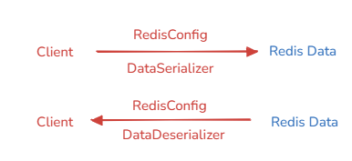

- Entity / Record(DTO)

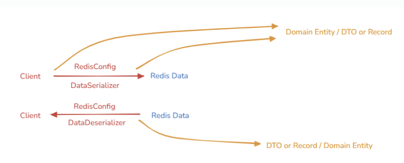
